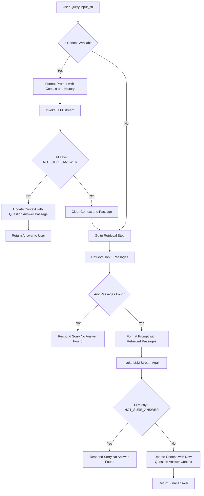

# Agendas

* Datasets
* Models
* VPA Overall System Integration


---

# Datasets

## BanServ2SQL 

```
d.1.a) BanServ2SQL: The Bangla Service to SQL dataset contains Bangla service-related running texts and their corresponding structured information through SQL. The Collection of Bangla running and raw text covering general unstructured data along with Bangladeshi governmental and private services and use-case-related unstructured data so that the VPA system could retrieve the service-related necessary information. The dataset should be collected from real use and be non-duplicate, not generated by an algorithm and the metadata should be checked by a single human. Document or paragraph-level clean data could be collected from all service-providing and knowledge government portals such as the National portal (for all types of administrative notice, contact name- number, rules of business, citizen charter, etc.). 
Also, other Publicly open and public serving portals might be useful such as PSC (for govt information).Also, there should have a portion on private service providers such as food delivery portals (for location, address, and menu), newspaper portals (for shopping, job, sports, and related queries), city guides (for transport schedule), Banking portals (for loan and currency, ATM location,branch information), etc.
The size of the dataset should be at least 3GB considering UTF-8 clean text or 2 lac documents which is higher. 
Additionally, It could add information from copyright non-restricted (i.e Wiki article).

d.1.b) The dataset is a converted format of running text into the structured format as SQL dB. It is a curated and selected representation of the aforementioned text. The main feature of this dataset is to arrange structured/ tabular data from running/ unstructured text. The size of the dataset is at least 2 lac queries having balance and representativeness as per use cases of VPA. 
For format, Wiki2SQL and Piccard datasets might be followed.
```

### Passage collection
* Datasources: PREVIEW
* Collection: 
    * Scrapping,crawling,manual collection etc
    * hugging face - oscar data, wikipedia data etc 
    * metadata storing
* Cleaning 
    * Remove references like [1], [2], etc.
    * Remove URLs
    * Remove HTML entities
    * Normalize whitespace
    * Preserve Bangla characters, spaces, and specific punctuation (.,?!)
* Normalization (During useage)
    * We are using [bnunicodenormalizer](https://github.com/mnansary/bnUnicodeNormalizer)
    * Not NFKD,NFKC due to ZWNJ
    * Not utf-8 clean 

```json
{
  "meta": {
    "title": "মনস্তত্ত্ববিদের তালিকা",
    "id": 1437,
    "source": "wikidump"
  },
  "text": "এই তালিকায়, উল্লেখযোগ্য মনস্তত্ত্ববিদ এবং মনোবিজ্ঞানে অবদানকারী অন্তর্ভুক্ত। মনস্তত্ত্ববিদদের নিচে তালিকাভুক্ত করা হলোঃ  আ আব্রাহাম মাসলো উ উইলিয়াম জেমস ই ইবনে রুশদ ইভান পাভলভ ক ক্যারল গিলিগ্যান জ জঁ পিয়াজেঁ ন নোম চম্স্কি ভ ভি এস রামচন্দ্রন ম মার্টিন ডেইলি র রবিন ডানবার স সিগমুন্ড ফ্রয়েড স্টিভেন পিংকার আরোও দেখুন বিষয়শ্রেণীমনস্তত্ববিদ বিষয়শ্রেণীমনোবিজ্ঞানী"
}
```

### SQL Formatting 
* using chromadb
* **THIS WILL BE AGAIN DISCUSSED IN MODELING SECTION**

## BanConvComm

```
d.2) BanConvComm: The Bangla conversation and command dataset/ chat dataset should cover all types of chat-related queries maintaining dialogue flow. 
It will include all possible rational responses considering the question/command. 
Also, the intent of the queries should be kept in this dataset. 
The input question and command should include short commands to long questions.
It should cover all general common questions/commands along with the necessary intents for classifications. 
Also, the dataset will consider the sequences of sentences to understand the dialogue flow. 
The size of the dataset is at least 2 lac question response alignment covering at least eight intents.
```

* Free form intent / unsupervised covering more than eight intents
* hierarchical intent 
    * advantage: <BOE> and <EOE> classifications are not necessary 
* natural conversation flow for context 

```json
{
  "user": [
    "তুমি কি জানো ১৭০১ সালে সুইজারল্যান্ডের প্রোটেস্ট্যান্টরা কী প্রবর্তন করেন?",
    "ওহ, তা খুব আগ্রহের! আর দক্ষিণ করোলিনার চার্লসস্টনে কখন জনগণের জন্য প্রথম ঔপনিবেশিক আমেরিকান জাদুঘর খোলা হয়?",
    "সেটা খুব ভালো! আর ভারতের গভর্নর জেনারেল হিসেবে কে কলকাতায় আসেন?",
    "তারপর? পূর্ব পাকিস্তানের গভর্নর কে ছিলেন?",
    "সেটা খুব ভালো! আর বাংলাদেশ চীন মৈত্রী সম্মেলন কেন্দ্রের উদ্বোধন কখন হয়?",
    "ওহ, তা খুব আগ্রহের! আর ক্যাপ্টেন নুরুল হক কী ছিলেন?",
    "সেটা খুব ভালো! আর আটলি এস এম হায়দার কে ছিলেন?",
    "তারপর? নেলী সেনগুপ্তা কে ছিলেন?"
  ],
  "response": [
    "হ্যাঁ, ১৭০১ সালে সুইজারল্যান্ডের প্রোটেস্ট্যান্টরা খ্রিস্টীয় ক্যালেন্ডার প্রবর্তন করেন। তারা এই ক্যালেন্ডারটি ব্যবহার করে তাদের ধর্মীয় ও সামাজিক কার্যক্রম পরিচালনা করত।",
    "১৭৭৩ সালে দক্ষিণ করোলিনার চার্লসস্টনে জনগণের জন্য প্রথম ঔপনিবেশিক আমেরিকান জাদুঘর খোলা হয়। এটি ছিল একটি গুরুত্বপূর্ণ ঘটনা যা আমেরিকান সংস্কৃতি ও ইতিহাসের বিকাশে ভূমিকা রাখে।",
    "১৮৪৮ সালে লর্ড ডালহৌসি ভারতের গভর্নর জেনারেল হিসেবে কলকাতায় আসেন। তিনি ভারতের ইতিহাসে একজন গুরুত্বপূর্ণ ব্যক্তিত্ব ছিলেন।",
    "রিয়ার এডমিরাল এসএম আহসান পূর্ব পাকিস্তানের গভর্নর ছিলেন। তিনি পূর্ব পাকিস্তানের রাজনৈতিক ও সামাজিক কার্যক্রমে গুরুত্বপূর্ণ ভূমিকা পালন করেন।",
    "২০০২ সালে বাংলাদেশ চীন মৈত্রী সম্মেলন কেন্দ্রের উদ্বোধন হয়। এটি বাংলাদেশ ও চীনের মধ্যে সম্পর্কের একটি গুরুত্বপূর্ণ মাইলফলক।",
    "ক্যাপ্টেন নুরুল হক বাংলাদেশ নৌবাহিনীর প্রথম নৌপ্রধান ছিলেন। তিনি বাংলাদেশের স্বাধীনতা যুদ্ধে গুরুত্বপূর্ণ ভূমিকা পালন করেন।",
    "এ.টি.এম. হায়দার বাংলাদেশী মুক্তিযোদ্ধা এবং বীর উত্তম খেতাব প্রাপ্ত সেক্টর কমান্ডার ছিলেন। তিনি বাংলাদেশের স্বাধীনতা যুদ্ধে গুরুত্বপূর্ণ ভূমিকা পালন করেন।",
    "নেলী সেনগুপ্তা একজন রাজনৈতিক ও সমাজকর্মী ছিলেন যিনি দেশকে পরাধীনতার শৃঙ্খল থেকে রক্ষা করার জন্য নিরলস সংগ্রাম করেছিলেন। তিনি বাংলাদেশের স্বাধীনতা যুদ্ধে গুরুত্বপূর"
  ],
  "intents": [
    "history.switzerland.event",
    "museum.opening_date",
    "government.governor_general.name",
    "government.east_pakistan.governor",
    "conference_center.opening_date",
    "person.biography",
    "person.identity",
    "person.identity"
  ],
  "num_entries": 8
}
```

# BanQA

```
d.3) BanQA: This dataset should include questions/commands, the paragraph/document having inline answers, and specific answers to the corresponding question/s.
The answer could be the response as part of dialogue without returning any specific close result or could be the response/result of having retrieved specific information. Moreover, the questions could have multiple answers or only one accurate result. 
The size of the dataset is at least 2 lac QA covering use cases of the system.
d.3.1) All the datasets should cover a wide range of named entities (name, place, org, Object,GPE/S etc.) and all geo-political entities 
should cover up to the village level for Bangladesh and up to the city level globally.
d.3.2) It is expected that the BanQA will be aligned with other datasets for this assignment. For example, answers could be retrieved from the structure-unstructured repository. Many questions could be found from BanQA text properties, and answers could be available at BanServ2SQL, and on the web.

```

* context based question and answer 
* Not formed as natural conversation - Because a question can be asked isolatedly  

```json
{
  "id": 15239,
  "title": "উপসর্গ (ব্যাকরণ)",
  "text": "উপসর্গ বা আদ্যপ্রত্যয় হলো ভাষায় ব্যবহৃত কিছু অব্যয়সূচক শব্দাংশ যাদের নিজস্ব কোনো অর্থ নেই, কিন্তু অর্থের দ্যোতনা তৈরির ক্ষমতা আছে।বাংলা ভাষার ব্যাকরণ ও নির্মিতি, ২০২১ শিক্ষাবর্ষ, জাতীয় শিক্ষাক্রম ও পাঠ্যপুস্তক বোর্ড, ঢাকা, বাংলাদেশ উপসর্গ শব্দ বা শব্দমূলের শুরুতে বসে নতুন অর্থবহ শব্দ তৈরি করে, শব্দাংশের শুরুতে বসে না। উপসর্গ যুক্ত হলে কোনো শব্দের বিপরীত শব্দ তৈরি হয় অথবা অর্থের উৎকর্ষ বা সংকোচন হয়। উপসর্গ সম্পর্কিত আলোচনা ব্যাকরণের রূপতত্ত্বের অন্তর্ভুক্ত। ব্যুৎপত্তি ও সংজ্ঞা উপসর্গ শব্দটির রূপতত্ত্বগত বিশ্লেষণ  উপ  সৃজ্  অ। উপসর্গ কথাটির মূল অর্থ উপসৃষ্ট। যেসব অর্থহীন অব্যয় পদ নামবাচক বা কৃদান্ত শব্দের পূর্বে যুক্ত হয়ে নতুন শব্দ গঠন করে এবং অর্থের পরির্বতন সাধন করে, এগুলোকে উপসর্গ বলে। ড. সুনীতিকুমার চট্টোপাধ্যায়ের মতে, ড. মুহাম্মদ এনামুল হকের মতে, অশোক মুখোপাধ্যায়ের মতে, ড. রামেশ্বর শএর মতে, উপসর্গ ও অনুসর্গ অনুসর্গ হলো কিছু অব্যয়সূচক শব্দ যেগুলো কখনো স্বাধীন পদরূপে, আবার কখনো শব্দ বিভক্তির মতো বাক্যে ব্যবহৃত হয়ে বাক্যের অর্থ প্রকাশে সাহায্য করে।বাংলা ভাষার ব্যাকরণ, নবমদশম শ্রেণি, ২০১৬ শিক্ষাবর্ষ, জাতীয় শিক্ষাক্রম ও পাঠ্যপুস্তক বোর্ড, ঢাকা, বাংলাদেশ উপসর্গ ও অনুসর্গের মাঝে পার্থক্য রয়েছে। উপসর্গ ধাতু বা নামপ্রকৃতির সঙ্গে যুক্ত হয়ে একটি শব্দের মতো আচরণ করলেও অনুসর্গ পূর্বের পদ থেকে পৃথকভাবে আশ্রিত হিসাবে অবস্থান করে। প্রতি ও অতি  উপসর্গ দুটি ব্যতীত আর কোনো উপসর্গের স্বতন্ত্র প্রয়োগ নেই, কিন্তু সকল অনুসর্গের স্বতন্ত্র প্রয়োগ আছে। উপসর্গ ধাতু বা নামপ্রকৃতির আগে বসে সেই ধাতু বা নামপ্রকৃতির অর্থপরিবর্তন ঘটিয়ে নতুন শব্দ গঠন করে। অন্যদিকে, অনুসর্গ বিশেষ্য ও সর্বনাম পদের পরে বসে শব্দ বিভক্তির কাজ করে। প্রকারভেদ বাংলা ভাষায় অর্ধশতাধিক উপসর্গ রয়েছে। এই উপসর্গগুলোকে সাধারণত তিনটি ভাগে ভাগ করা হয়ে থাকে তৎসম (সংস্কৃত) উপসর্গ এ ধরনের উপসর্গ সংস্কৃত শব্দের আগে বসে। বাংলা ভাষায় ব্যবহৃত তৎসম উপসর্গ ২০টি, যথা অতি, অধি, অনু, অপ, অপি, অব, অভি, আ, উপ, উত্, দুর্, নি নির্নির, পরা, পরি, প্র, প্রতি, বি, সু ও সম্। খাঁটি বাংলা উপসর্গ এ ধরনের উপসর্গ বাংলা শব্দের আগে বসে। বাংলা ভাষায় ব্যবহৃত খাঁটি বাংলা উপসর্গ ২২টি, যথা অ, অঘা, অজ, অনা, আ, আড়্, আন, আব, ইতি, উন্, কদ, কু, নি, পাতি, বি, ভর, রাম,অন, স, সা, সু ও হা। উল্লেখ্য, আ, নি, বি, সু  এই চারটি উপসর্গ সংস্কৃত ও বাংলা উভয় ভাষাতে ব্যবহৃত হয়। ব্যবহারের উপর নির্ভর করে নির্ধারণ করা হয় এরা খাঁটি বাংলা না সংস্কৃত উপসর্গ। বিদেশি উপসর্গ ফারসি উপসর্গ  কম, কার, দর, না, নিম, ফি, ব, বে, বর, বদ। আরবি উপসর্গ  আম, খাস, খয়ের, গর্, বাজে, লা। উর্দু হিন্দি উপসর্গ  হর, হরেক। ইংরেজি উপসর্গ  ফুল, সাব, হাফ, হেড। উপসর্গে হাইফেন উপসর্গে কখনো কখনো হাইফেন ব্যবহার করা হয়, বিশেষ করে যখন হাইফেনবিহীন বানান অন্য কোনো শব্দের অনুরূপ হয়ে যায় অথবা যখন উপসর্গ যোগ করলে সাধিত শব্দটি ভুল ব্যাখ্যাযোগ্য, অস্পষ্ট বা একরকম আজব বলে মনে হয় (উদাহরণস্বরূপ, যেভাবে ঐ দ্বারা যেন বর্ণ না বোঝায় তাই বিভ্রান্তি এড়াতে বাক্যে ওই ব্যবহার করা হয়)। যাইহোক, শব্দগঠনে সাধারণত হাইফেনহীন পদ্ধতি ব্যবহার করা হয়, বিশেষ করে তখন, যখন সাধিত শব্দটি বিভিন্ন প্রসঙ্গে ব্যাপক ব্যবহারের মাধ্যমে তুলনামূলকভাবে পরিচিত বা জনপ্রিয় হয়ে উঠে। প্রচলিত নিয়মে হাইফেনের অভাবে কোনো সাধিত শব্দের অর্থের স্পষ্টতা বিঘ্নিত না হওয়া পর্যন্ত উপসর্গের পর হাইফেন দেওয়া হয় না। সাধারণত বিদেশি উপসর্গের ক্ষেত্রে, স্বরধ্বনি দ্বারা শুরু হওয়া শব্দ ও উপসর্গকে পৃথক করে বোঝাতে বা অর্থের ভুল উচ্চারণ রোধে উপসর্গের পর হাইফেন ব্যবহার করা যেতে পারে, যেমন ইংরেজি  (সাবিউনিট) এর পরিবর্তে  (সাবইউনিট)। কোনো শব্দ অধিক প্রচলিত হয়ে গেলে হাইফেন ব্যবহৃত হয় না, যেমন হেডমাস্টার এর পরিবর্তে হেডমাস্টার। সাধারণত বর্তমানে উপসর্গযোগে শব্দ গঠনে হাইপেন ব্যবহার করা হয় না  কিন্তু করলে কোন সমস্যা নেই  আরও দেখুন প্রত্যয় বাংলা উপসর্গের তালিকা তথ্যসূত্র বিষয়শ্রেণীবাংলা ব্যাকরণ বিষয়শ্রেণীআভিধানিক একক বিষয়শ্রেণীভাষাবিজ্ঞান পরিভাষা বিষয়শ্রেণীশব্দ (ভাষা)",
  "question": [
    "উপসর্গ কী?  ",
    "উপসর্গের কাজ কী?  ",
    "উপসর্গ ও অনুসর্গের মধ্যে পার্থক্য কী?  ",
    "উপসর্গের প্রকারভেদ কী?  ",
    "তৎসম উপসর্গ কী?  ",
    "খাঁটি বাংলা উপসর্গ কী?  ",
    "বিদেশি উপসর্গ কী?  ",
    "উপসর্গে হাইফেন ব্যবহার করা হয় কিনা?  ",
    "উপসর্গ ব্যবহারের নিয়ম কী?  "
  ],
  "answer": [
    "উপসর্গ হলো ভাষায় ব্যবহৃত কিছু অব্যয়সূচক শব্দাংশ যাদের নিজস্ব কোনো অর্থ নেই, কিন্তু অর্থের দ্যোতনা তৈরির ক্ষমতা আছে।",
    "উপসর্গ শব্দ বা শব্দমূলের শুরুতে বসে নতুন অর্থবহ শব্দ তৈরি করে, শব্দাংশের শুরুতে বসে না।",
    "উপসর্গ ও অনুসর্গের মাঝে পার্থক্য রয়েছে। উপসর্গ ধাতু বা নামপ্রকৃতির সঙ্গে যুক্ত হয়ে একটি শব্দের মতো আচরণ করলেও অনুসর্গ পূর্বের পদ থেকে পৃথকভাবে আশ্রিত হিসাবে অবস্থান করে।",
    "উপসর্গকে সাধারণত তিনটি ভাগে ভাগ করা হয়ে থাকে: তৎসম (সংস্কৃত) উপসর্গ, খাঁটি বাংলা উপসর্গ এবং বিদেশি উপসর্গ।",
    "তৎসম উপসর্গ হলো সংস্কৃত শব্দের আগে বসে এমন উপসর্গ, যেমন অতি, অধি, অনু, অপ, অপি, অব, অভি, আ, উপ, উত্, দুর্, নি নির্নির, পরা, পরি, প্র, প্রতি, বি, সু ও সম্।",
    "খাঁটি বাংলা উপসর্গ হলো বাংলা শব্দের আগে বসে এমন উপসর্গ, যেমন অ, অঘা, অজ, অনা, আ, আড়্, আন, আব, ইতি, উন্, কদ, কু, নি, পাতি, বি, ভর, রাম,অন, স, সা, সু ও হা।",
    "বিদেশি উপসর্গ হলো ফারসি, আরবি, ইংরেজি ইত্যাদি ভাষা থেকে আগত উপসর্গ, যেমন ফারসি উপসর্গ: কম, কার, দর, না, নিম, ফি, ব, বে, বর, বদ; আরবি উপসর্গ: আম, খাস, খয়ের, গর্, বাজে, লা; ইংরেজি উপসর্গ: ফুল, সাব, হাফ, হেড।",
    "উপসর্গে কখনো কখনো হাইফেন ব্যবহার করা হয়, বিশেষ করে যখন হাইফেনবিহীন বানান অন্য কোনো শব্দের অনুরূপ হয়ে যায় অথবা যখন উপসর্গ যোগ করলে সাধিত শব্দটি ভুল ব্যাখ্যাযোগ্য, অস্পষ্ট বা একরকম আজব বলে মনে হয়।",
    "প্রচলিত নিয়মে হাইফেনের অভাবে কোনো সাধিত শব্দের অর্থের স্পষ্টতা বিঘ্নিত না হওয়া পর্যন্ত উপসর্গের পর হাইফেন দেওয়া হয় না।"
  ],
  "num_entries": 9
}
```

# Models

```
The consultant will perform all modelling-related tasks. They will perform all necessary data wrangling, training, and pretraining-related tasks and they will bear all hardware-related costs. 
The modelling pipeline and methodology will be selected in the inception stage after a comparative study of SOTA technologies. 
The VPA system could be an end-to-end monolith or a combination of multiple models, the below-mentioned models could be helpful to develop the VPA system. However, the consultant should develop models to solve at least 3 problems (but not limited to):

* BanDialnt: Intent recognition from Dialogue: The system could understand the intents of the input sentence considering the rich NER 
* BanInfRet: Information Retrieval and question answering from the text (structured & unstructured): The system could retrieve necessary information from the repository (as per question and command). 
* BanResGen: Response Generation in Dialogue: The system could be able to generate a response covering intents and retrieved information. The response should be meaningful and relevant to the previous queries.
```

* BanInfRet: 
    * Embedding creation. 
    * base model: "l3cube-pune/bengali-sentence-similarity-sbert"
* BanDiaInt:
    * Intent Generation
    * base model: llama3.3 (Instruct 70B)
    * temperature: 0.2
    * context: 4096 
* BangResGen:
    * Response and Answer Generation     
    * base model: llama3.3 (Instruct 70B)
    * temperature: 0.1
    * context: 128k

**[DemoLink](http://103.180.245.115:3030/)** 

## VPA Overall System Integration




**[DemoLink](http://103.180.245.115:3032/)** 